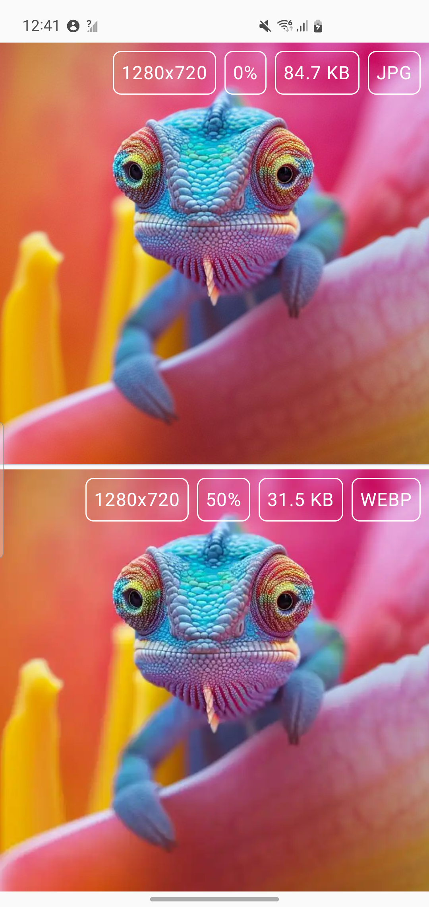
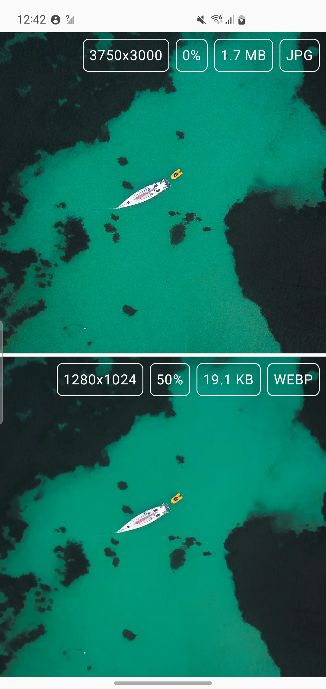

# ImForge
[](https://opensource.org/licenses/MIT)
[](https://central.sonatype.com/artifact/io.github.nuclominus/imforge)
[](https://github.com/Nuclominus/ImForge/actions/workflows/pr_code_analyzing.yml)

ImForge library is a powerful tool designed to optimize and compress images in your Android
applications.
Library is written in Kotlin and is compatible with AndroidX. It is lightweight and has no
dependencies.

## Features

- **Optimize images**: Reduce the size of your images without losing quality.
- **Compress images**: Compress your images to reduce the size of your APK.
- **Supports convert image formats**: Standard Bitmap compress formats: PNG, JPG, WEBP.
- **Change image qualities**: Change the quality of your images.
- **Change the resolution of the image**: Change the resolution of your images.

## Installation

Add the following dependency to your `build.gradle` file:

```gradle
dependencies {
    implementation 'io.github.nuclominus:imforge:$latest_version'
}
```

or use version catalog:

```yaml

[versions]
imforge = $last_version
...
[libraries]
...
nuclominus-imforge = { group = "io.github.nuclominus", name = "imforge", version.ref = "imforge" }

```

## Usage

### Optimize images

For image optimization, you can use the `optimize` extension for `File` type.

```kotlin
val optimizedImage = File("path/to/image").optimize() // optimize image with default settings
```

### Configure optimization

You can configure the optimization process by using the `Configuration` class.

```kotlin
val configuration = Configuration(
    compressFormat = Bitmap.CompressFormat.WEBP, // image format
    quality = 50, // image quality
    maxWidth = 1280f, // max image width
    maxHeight = 720f, // max image height
    minWidth = 640f, // min image width
    minHeight = 480f // min image height
)

val optimizedImage = File("path/to/image").optimize(configuration)
```

### Example

There are several examples of using the library. Also you can see the example app:

   
